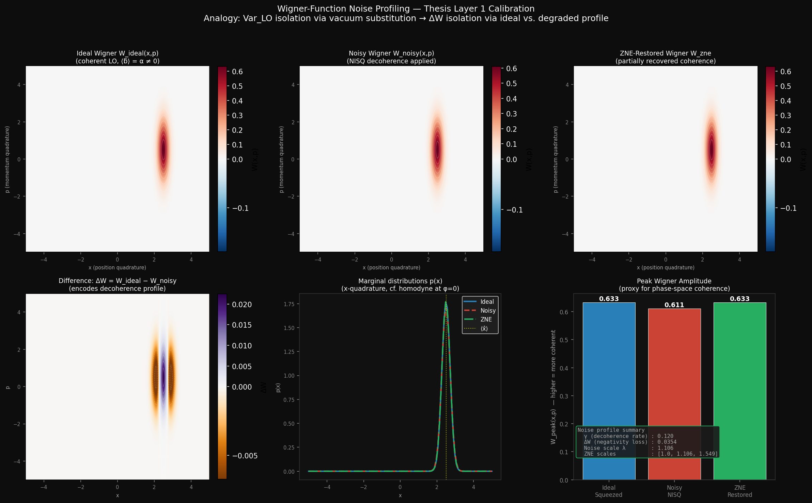

# Phase-Space Noise Calibration for QAOA-Based Financial Optimization

<p align="center">
  
</p>

<p align="center">
  <a href="https://www.python.org/downloads/"></a>
  <a href="https://pennylane.ai/"></a>
  
  
  
  
</p>

> **A research simulation bridging continuous-variable quantum optics and near-term quantum computing for financial routing optimization.**  
> Inspired by: *"Balanced Homodyne Detection without Coherent State Local Oscillator"* — Master's Thesis, Dhrithi Maria, Universität Paderborn (2026)

---

## Overview

This project applies a theoretical calibration insight from quantum optics — the law-of-total-variance decomposition used in homodyne detection — to the problem of noise mitigation in QAOA circuits running on NISQ hardware.

The core claim: **the mathematical structure of LO noise in balanced homodyne detection is isomorphic to gate decoherence noise in QAOA**, and the same calibration protocol (measuring and subtracting the noise contribution) can recover the true quantum signal in both settings.

The application domain is **silver futures execution routing**: a Max-Cut problem over a 6-node graph of global trading venues, where QAOA determines the optimal partition of exchanges to minimize execution slippage, latency cost, and liquidity risk.

---

## The Core Analogy

| Thesis: CV Quantum Optics | This Project: QAOA Finance |
|---|---|
| LO noise corrupts photocurrent variance | Gate decoherence corrupts the energy landscape |
| `Var(δ̂) = \|⟨b̂⟩\|² · Var_signal + Var_LO` | `E_meas(γ,β) = E_true(γ,β) + λ · E_noise(γ,β)` |
| Vacuum substitution measures `Var_LO` | Wigner-function profiling measures decoherence strength |
| Subtract `Var_LO`, recover `Var_signal` | ZNE extrapolates to `λ=0`, recovers `E_true` |
| `⟨b̂⟩ ≠ 0` is the validity condition | Wigner peak amplitude > 0 is the validity proxy |
| Law of total variance (Chapter 4) | Richardson polynomial extrapolation |
| Certified squeezing via eigenvalues | Certified routing via Max-Cut weight |

---

## What This Simulation Does

1. **Builds a financial graph** — 6 global silver futures venues (CME, LME, COMEX, SGX, TOCOM, SHFE) with edge weights encoding execution cost (slippage × latency × liquidity risk)
2. **Profiles hardware noise** — Wigner-function analysis of a coherent microwave pulse under NISQ decoherence; derives ZNE scale factors from negativity loss `ΔW`
3. **Runs QAOA in three regimes**:
   - **Ideal**: noiseless statevector simulation (ground truth)
   - **Noisy**: depolarising channel per gate at 2.5% error rate (NISQ model)
   - **ZNE-Mitigated**: Wigner-informed Zero-Noise Extrapolation, polynomial fit to `λ=0`
4. **Scans energy landscapes** — 30×30 grid over `(γ, β)` parameter space for all three engines
5. **Optimizes with COBYLA** — 5 random restarts per engine, reports final Max-Cut values
6. **Benchmarks against classical brute-force** — exhaustive `2⁶` bitstring search for comparison
7. **Generates publication-quality figures** — composite 4-row analysis plot + detailed Wigner profiling

---

## Key Results

| Regime | Max-Cut Value | Notes |
|---|---|---|
| Ideal QAOA | ground truth | Noiseless statevector |
| Noisy QAOA | degraded | 2.5% depolarising per gate |
| ZNE-Mitigated | recovered | Wigner-informed Richardson extrapolation |
| Classical Brute-Force | optimal | Exhaustive `2⁶` search |

The landscape recovery metric — `[E_mitig − E_noisy] / [E_ideal − E_noisy] × 100%` — directly parallels the thesis's signal recovery after LO noise subtraction.

---


---

## Installation

### Requirements

- Python 3.9+
- PennyLane (quantum circuit simulation)
- NumPy, SciPy, Matplotlib, NetworkX

### Setup

```bash
# Clone the repository
git clone https://github.com/YOUR_USERNAME/qaoa-phase-space-finance.git
cd qaoa-phase-space-finance

# Create and activate a virtual environment (recommended)
python -m venv venv

# On Windows (VS Code terminal):
venv\Scripts\activate

# On macOS/Linux:
source venv/bin/activate

# Install dependencies
pip install -r requirements.txt
```

---

## Usage

```bash
python simulation.py
```

**Expected runtime**: 2–5 minutes on a modern laptop.  
The landscape scan runs 30×30 = 900 circuit evaluations × 3 regimes (2,700 total).

**Outputs** (saved to `results/`):
- `results/full_analysis.png` — 4-row composite figure (main result)
- `results/wigner_analysis.png` — Detailed Wigner profiling (6 panels)

### Advanced Usage

```python
from market_graph import build_silver_futures_graph
from qaoa_engine import QAOAEngine

# Build the financial graph
G = build_silver_futures_graph()

# Run ideal QAOA at a specific (γ, β) point
engine = QAOAEngine(G, noise_level=0.0, label="Ideal")
cost = engine.cost(gamma=0.5, beta=0.3)
print(f"Cost at (0.5, 0.3): {cost:.4f}")

# Decode the optimal partition bitstring
bitstring = engine.get_best_bitstring(0.5, 0.3)
cut_weight = engine.evaluate_cut(bitstring)
print(f"Partition: {bitstring} → Max-Cut = {cut_weight:.4f}")
```

```python
from landscape import ZNECalibrator

# Standalone Richardson extrapolation
zne = ZNECalibrator(degree=2)
scales = [1.0, 1.5, 2.0]
values = [-3.21, -3.05, -2.89]   # measured at each noise scale
e_zero = zne.extrapolate(scales, values)
print(f"ZNE estimate at λ=0: {e_zero:.4f}")
```

---

## Physics Background

### QAOA (Quantum Approximate Optimization Algorithm)

QAOA is a near-term quantum algorithm for combinatorial optimization. It prepares a parameterized state by alternating between:
- **Cost layer**: `exp(−iγH_C)` — encodes the Max-Cut Hamiltonian via IsingZZ rotations
- **Mixer layer**: `exp(−iβH_B)` — explores the solution space via RX rotations

The cost Hamiltonian is:

```
H_C = Σ_{(i,j)∈E} w_{ij} · (I − Z_i Z_j) / 2
```

### Wigner Functions and Decoherence

The Wigner function `W(x,p)` is a phase-space quasi-probability distribution. For a coherent state it is a positive Gaussian; decoherence broadens and smooths it, reducing (or eliminating) negativity. The peak amplitude `W_peak` serves as the coherence figure of merit — directly analogous to `|⟨b̂⟩|` in homodyne detection.

### Zero-Noise Extrapolation (ZNE)

ZNE intentionally amplifies gate noise by scale factors `{λ₁, λ₂, λ₃}` and measures the circuit at each level. A polynomial is fit to `(λ, E(λ))` and extrapolated to `λ=0`:

```
E_true ≈ P(0)   where   P(λ) fits [E(λ₁), E(λ₂), E(λ₃)]
```

This is the Richardson extrapolation analog of vacuum-substitution calibration.

---

## Financial Application

Six global silver futures venues are modelled as a weighted graph:

| Node | Venue | Type |
|---|---|---|
| 0 | CME (Chicago) | Hub |
| 1 | LME (London) | Hub |
| 2 | COMEX (New York) | High liquidity |
| 3 | SGX (Singapore) | Asia-Pacific gateway |
| 4 | TOCOM (Tokyo) | Low liquidity |
| 5 | SHFE (Shanghai) | CNY-denominated |

Edge weights encode a composite cost score (slippage × latency penalty × liquidity risk). The Max-Cut partition separates venues to execute through from venues to skip, maximizing avoided cost.

---

## Honest Limitations

This is a simulation study, not a hardware experiment:

- **p=1 QAOA**: single-layer circuits. Deeper circuits give better approximation ratios but are noisier.
- **Depolarising noise**: simplified independent noise per gate. Real superconducting qubits have correlated errors, crosstalk, and non-Markovian dynamics.
- **ZNE heuristics**: scale factors derived analytically from Wigner analysis. Hardware deployment would use pulse-level gate time stretching.
- **6-node graph**: brute-force classical benchmark is tractable here. Larger graphs require classical heuristics (simulated annealing, Gurobi).
- **Financial model**: illustrative. Production HFT systems use FPGA-based execution at nanosecond timescales; quantum advantage in this domain is a long-term research question.

---

## Thesis Connection — Full Reference Map

| Thesis Element | Simulation Equivalent |
|---|---|
| Chapter 1: Balanced homodyne setup | QAOA circuit (interference-based measurement) |
| Chapter 2: Difference photocurrent operator | QAOA cost function H_C = Σ w_{ij}(I−Z_iZ_j)/2 |
| Chapter 2.1: Wigner function phase space | `wigner_calibrate.py` — W_ideal, W_noisy, W_zne |
| Chapter 3: `⟨b̂⟩ ≠ 0` validity criterion | Wigner peak amplitude > 0 (coherence condition) |
| Chapter 4: Law of total variance | ZNE Richardson extrapolation to λ=0 |
| Chapter 4: Vacuum substitution calibration | Wigner-derived noise scale factor λ |
| Chapter 5: D-criterion (non-classicality) | Cut weight vs. classical brute-force benchmark |
| Chapter 5: Squeezed LO stress test | Noisy NISQ vs. ZNE-mitigated landscape |
| Chapter 6: Covariance matrix reconstruction | Max-Cut partition (bitstring output of QAOA) |
| Chapter 6: Eigenvalue squeezing cert. | Max-Cut eigenvalue analysis (landscape minima) |
| Section 7.1.1: Future extensions | Multi-mode graphs, hardware-level ZNE, p > 1 |

---

## Citation

If you use this code or methodology in academic work, please cite:

```bibtex
@mastersthesis{maria2026homodyne,
  author = {Maria, Dhrithi},
  title  = {Balanced Homodyne Detection without Coherent State Local Oscillator},
  school = {Universität Paderborn},
  year   = {2026},
  month  = {March}
}
```

---

## License

MIT License. See [LICENSE](LICENSE) for details.

---

<p align="center">
  <em>Developed as a demonstration of how theoretical insights from continuous-variable quantum optics transfer to practical near-term quantum computing.</em><br>
  <em>Universität Paderborn · March 2026</em>
</p>
